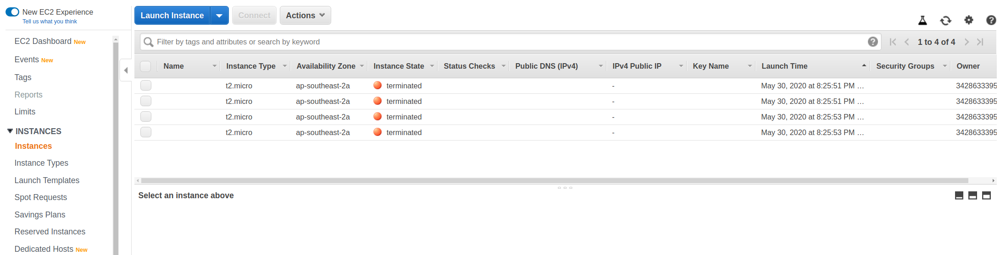

# Design, Provision and Monitor AWS Infrastructure at Scale

In this project, you will plan, design, provision, and monitor infrastructure in AWS using industry-standard and open source tools. You will practice the skills you have learned throughout the course to optimize infrastructure for cost and performance. You will also use Terraform to provision and configure AWS services in a global configuration.

## Project  Instructions

### Task 1: Create AWS Architecture Schematics

You have been asked to plan and provision a cost-effective AWS infrastructure for a new social media application development project for 50,000 single-region users. The project requires the following AWS infrastructure and services. Please include your name and label all elements of the infrastructure on the diagram.

[Infrastructure diagram](./Udacity_Diagram_1.pdf)

You have been asked to plan a SERVERLESS architecture schematic for a new application development project.

[Infrastructure diagram](./Udacity_Diagram_2.pdf)

### Task 2: Calculate Infrastructure Costs

Use the AWS Pricing Calculator to estimate how much it will cost to run the services in your diagram for one month.

[Initial Cost Estimate](./Initial_Cost_Estimate.csv)

Your budget has been reduced

[Reduced Cost Estimate](./Reduced_Cost_Estimate.csv)

Your budget has been increased

[Increased_Cost Estimate](./Increased_Cost_Estimate.csv)

### Task 3: Configure Permissions

[CloudTrail Log](./UdacityCloudTrailLog.csv)

### Task 4: Set up Cost Monitoring

### Task 5 : Use Terraform to Provision AWS Infrastructure

#### Exercise 1

1. Download the [starter code](https://github.com/udacity/cand-c2-project).
2. In the main.tf file write the code to provision
   * AWS as the cloud provider
   * Use an existing VPC ID
   * Use an existing public subnet
   * 4 AWS t2.micro EC2 instances named Udacity T2
   * 2 m4.large EC2 instances named Udacity M4
3. Run Terraform.
4. Take a screenshot of the 6 EC2 instances in the AWS console and save it as `Terraform_1_1`.
5. Use Terraform to  delete the 2 m4.large instances
6. Take an updated screenshot of the AWS console showing only the 4 t2.micro instances and save it as `Terraform_1_2`

#### Exercise 2

1. In the  Exercise_2 folder, write the code to deploy an AWS Lambda Function using Terraform. Your code should include:

   * A lambda.py file
   * A main.tf file with AWS as the provider, and IAM role for Lambda, a VPC, and a public subnet
   * An outputs.tf file
   * A variables.tf file with an AWS region

2. Take a screenshot of the EC2 instances page
3. Take a screenshot of the VPC page

### Task 6: Destroy the Infrastructure using Terraform

